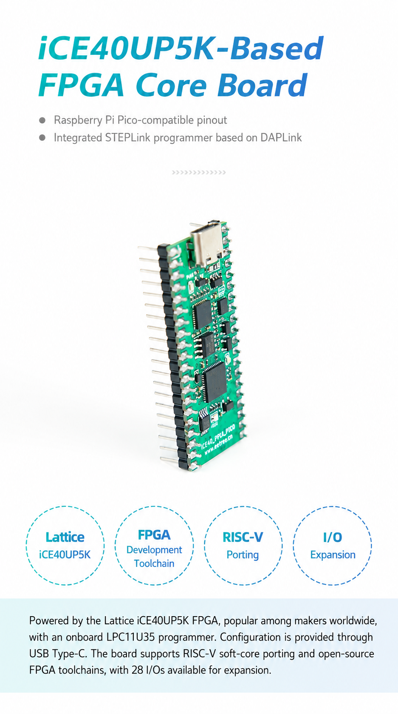
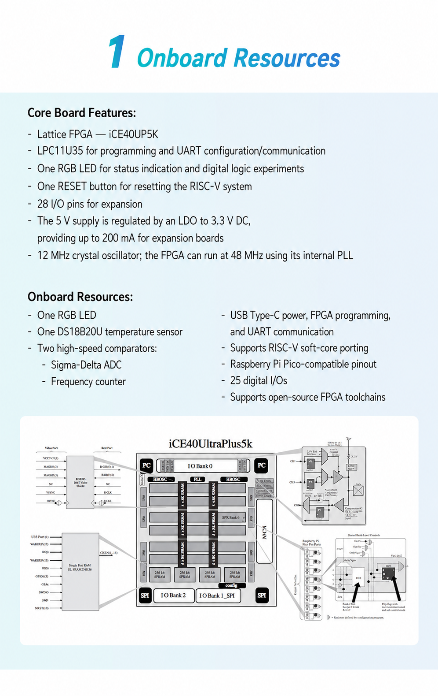
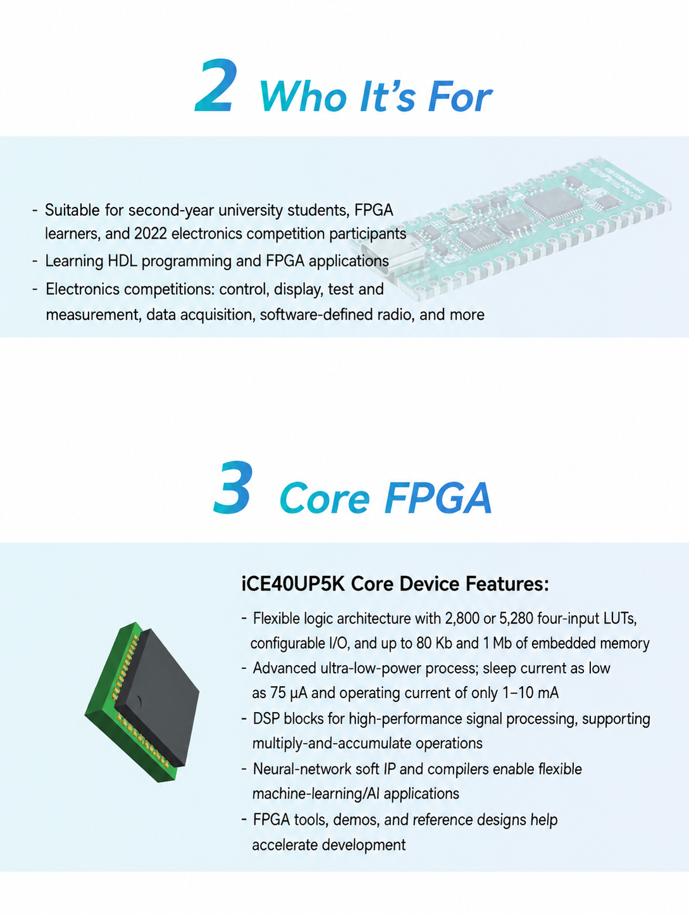
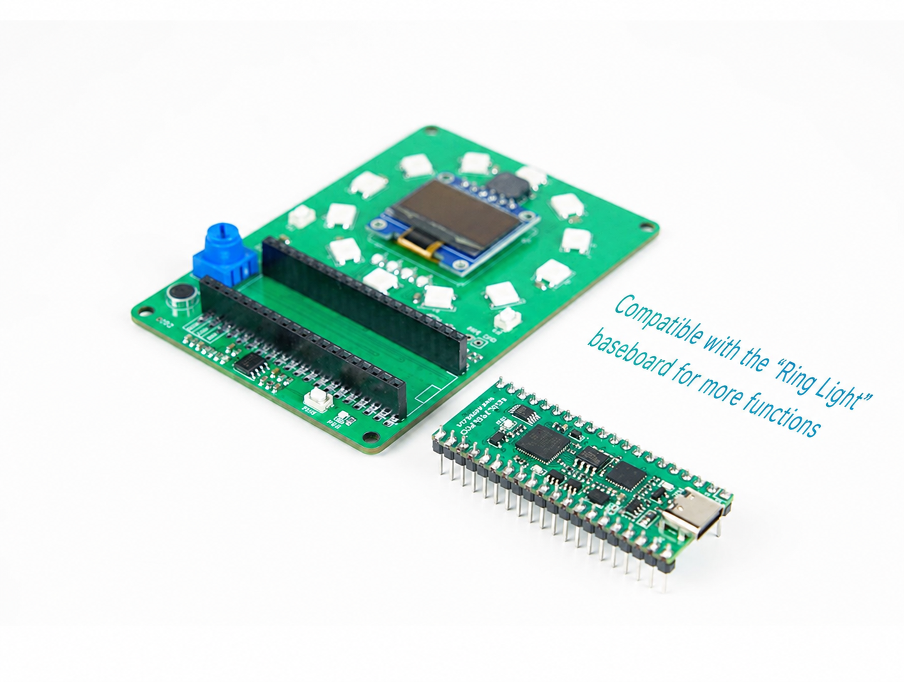

# iCE40 FPGA PICO

A compact FPGA development board based on the **Lattice iCE40UP5K**, with an onboard **LPC11U35 programmer/UART interface**, USB Type-C connection, and Raspberry Pi Pico-compatible physical pin arrangement.

Designed for **Verilog HDL development, digital logic experiments, custom FPGA applications, and RISC-V soft-core development**.



## Features

- **Lattice iCE40UP5K FPGA**
- Onboard **LPC11U35 programmer and UART interface**
- USB Type-C for power, FPGA programming, and UART communication
- **25 digital I/O pins**
- Raspberry Pi Pico-compatible physical pin arrangement
- Onboard RGB LED
- Onboard DS18B20U temperature sensor
- Two high-speed comparators
- Verilog HDL development
- Open-source FPGA toolchain support
- RISC-V soft-core development
- Compact format for breadboards and custom carrier boards

## Hardware Overview

The iCE40 FPGA PICO combines the FPGA, programming interface, serial communication, and several useful experimental peripherals on a compact board.

The **iCE40UP5K** runs the user FPGA design, while the onboard **LPC11U35** provides the normal FPGA programming and UART communication path.



### Onboard Resources

- **1 × RGB LED**  
  Useful for status indication, PWM, counters, state machines, and first FPGA experiments.

- **1 × DS18B20U temperature sensor**  
  Provides a practical digital sensor interface for timing and protocol experiments.

- **2 × high-speed comparators**  
  Can be used for experiments such as frequency measurement and FPGA-based Sigma-Delta ADC concepts.

- **25 digital I/O pins**  
  Provide access to external displays, sensors, communication devices, and custom digital circuits.

- **LPC11U35 programmer/UART interface**  
  Provides the normal FPGA programming path and serial communication with a host computer.

- **USB Type-C**  
  Used for board power, FPGA programming, and UART communication.



## Technical Specifications

| Item | Specification |
|---|---|
| FPGA | Lattice iCE40UP5K |
| Product type | FPGA core / development board |
| Programmer / UART | LPC11U35 |
| USB connector | USB Type-C |
| USB functions | Power, FPGA programming, UART |
| Digital I/O | 25 |
| Onboard LED | 1 × RGB LED |
| Temperature sensor | DS18B20U |
| Comparators | 2 × high-speed comparators |
| FPGA development | Verilog HDL |
| RISC-V | Soft-core implementation in FPGA fabric |
| Physical format | Raspberry Pi Pico-compatible pin arrangement |

## FPGA Programming & Development

The board includes an onboard **LPC11U35 programming interface**, so a separate external FPGA programmer is not required for the normal development workflow.

Connect the board to a computer using a **data-capable USB Type-C cable** to provide power and access the programming and UART interfaces.

The board is designed for **Verilog HDL development** and supports open-source FPGA development workflows.

A typical development cycle is:

1. Create or open an FPGA project for the iCE40UP5K.
2. Add your Verilog HDL design.
3. Apply the correct board pin constraints.
4. Synthesize and implement the design.
5. Generate the FPGA configuration.
6. Program the FPGA through the onboard LPC11U35 interface.
7. Verify the design using the RGB LED, UART, or external I/O.

For a new board, start with a simple RGB LED or UART design before moving to more complex projects.

## RISC-V Soft-Core Development

The iCE40UP5K can also be used for **RISC-V soft-core development**.

RISC-V support on this board refers to implementing a processor **inside the FPGA fabric**. The board does not contain a separate hard RISC-V application processor.

A soft-core design can combine the processor with FPGA peripherals such as:

- GPIO
- UART
- Timers and counters
- PWM
- Custom communication interfaces
- Memory-mapped peripherals
- Application-specific hardware accelerators

This makes the board useful for experimenting with both FPGA logic and hardware/software co-design.

## I/O and Expansion

The current board provides **25 digital I/O pins** and uses a **Raspberry Pi Pico-compatible physical pin arrangement**.

This makes the board convenient for breadboard use, compact carrier boards, and suitable Pico-format expansion hardware.

> **Note:** Pico-compatible refers to the physical pin arrangement. This board uses an iCE40UP5K FPGA rather than an RP2040 microcontroller. RP2040 firmware, Pico-specific MicroPython libraries, and accessories that depend on specific RP2040 peripherals do not automatically work with this board.

Always verify the pin mapping, signal voltage, direction, and required FPGA logic before connecting external hardware.

> **Important:** Do not assume that FPGA I/O pins are 5 V tolerant. Verify the required I/O voltage before connecting external signals and use level shifting where necessary.

## Applications

The board can be used for a wide range of FPGA learning and prototyping projects:

- FPGA and Verilog learning
- Combinational and sequential logic
- Finite-state machines
- Counters and timers
- PWM generation
- UART communication
- SPI and I2C interface development
- Temperature-sensor interfacing
- Frequency measurement
- Sigma-Delta ADC experiments
- Custom digital protocols
- RISC-V soft-core development
- Custom hardware accelerators
- FPGA-based embedded systems
- Pico-style carrier board development



## Onboard Sensor and Comparator Experiments

### DS18B20U Temperature Sensor

The onboard **DS18B20U** provides a real digital sensor for FPGA interface development.

It can be used to experiment with timing-sensitive communication, state machines, data acquisition, and RISC-V peripheral interfaces without requiring a separate temperature-sensor module.

### High-Speed Comparators

The board includes **two high-speed comparators** that can be connected to FPGA logic for measurement-oriented experiments.

Possible applications include:

- Edge counting
- Period measurement
- Frequency counting
- Comparator-based Sigma-Delta ADC concepts

Actual measurement performance depends on the external signal, comparator circuitry, FPGA clocking, and implemented logic.

## Getting Started

### 1. Connect the Board

Connect the board to your computer using a **data-capable USB Type-C cable**.

For the first power-up, leave external hardware disconnected until the basic programming workflow has been verified.

### 2. Set Up the FPGA Toolchain

Set up a compatible FPGA development environment for the **Lattice iCE40UP5K**.

Use the documentation in this repository for board-specific setup and programming information.

### 3. Create Your First Design

Start with a small Verilog HDL project such as:

- RGB LED control
- Counter
- PWM
- UART test

Make sure the project uses the correct device and board pin constraints.

### 4. Build and Program

Build the FPGA design and program the board through the onboard **LPC11U35** programming interface.

Verify the basic FPGA workflow before moving to sensors, comparators, external hardware, or a RISC-V soft core.

## Factory Demo


The factory demonstration provides a quick visual check that the FPGA is configured and running a design.

For development and hardware verification, use the documented FPGA examples and test each required interface independently.

## Documentation

Additional documentation is available in the [`docs/`](docs/) directory.

Refer to the documentation for board-specific information such as:

- Development environment setup
- FPGA programming
- Pin assignments
- Board resources
- Hardware connections
- RISC-V development information

## Repository Structure

```text
.
├── docs/       Documentation and technical references
├── images/     README and product images
└── README.md
```

Additional source code, FPGA examples, hardware design files, or software utilities can be added to dedicated directories as they become available.

## Notes

- Use a **data-capable USB Type-C cable** for programming and UART communication.
- Use the correct **iCE40UP5K** target and board constraints for FPGA projects.
- Do not assume Raspberry Pi Pico software compatibility simply because the physical pin arrangement is similar.
- Verify I/O voltage compatibility before connecting external hardware.
- RISC-V support refers to a **soft processor implemented inside the FPGA**, not a separate onboard CPU.
